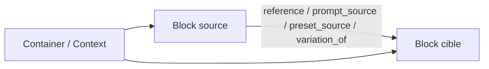

# SBC Metamodel Base

## Objectif

Ce document pose le méta-modèle de base de SBC pour la phase actuelle du projet.

SBC n'est pas seulement un gestionnaire d'assets.
C'est un référentiel local de démarche créative assistée par IA.

Le système doit permettre de stocker, organiser et relier :

- des assets finaux ou intermédiaires
- des prompts et presets
- des références visuelles, audio, vidéo ou textuelles
- des variantes
- des éléments de contexte créatif
- la méthode technique ayant conduit à une génération

L'objectif n'est pas de figer un sens unique pour chaque asset.
L'objectif est de pouvoir dire :

- dans quel contexte un asset est utilisé
- pour quel rôle créatif il sert
- quelle méthode a servi à produire le résultat suivant

---

## Principe central

Le sens d'un asset ne doit pas être porté principalement par l'asset lui-même.

Le sens émerge de trois choses :

1. le `Block`
2. le `contexte`
3. la `relation`

En conséquence :

- un `Block` reste relativement neutre
- le conteneur donne un contexte de travail
- la relation exprime le rôle joué par une source pour une cible

Exemple :

- une image n'est pas "la référence des vêtements" dans l'absolu
- elle est "référence des vêtements" pour un personnage, une sheet, une variation ou un shot donné

---

## Positionnement du modèle actuel

Le modèle actuel centré sur `Block` est compatible avec cette vision.

Référence code :

- `Block` : `src/domain/models.py`
- `InputConnection` : `src/domain/models.py`

Ce choix est bon tant que :

- le nombre de concepts premiers reste limité
- le sens métier fin passe par les relations et le contexte
- les `profile` restent peu nombreux et stables
- le contenu technique intrinsèque reste dans `content`

Le danger à éviter :

- mettre trop de sémantique dans `profile`
- tout mettre dans `tags`
- utiliser `content` comme zone fourre-tout sans conventions

---

## Concepts premiers

### 1. Block

Un `Block` représente une unité manipulable par le système.

Un block peut être :

- un asset
- un prompt
- un preset
- une note
- un conteneur
- une variation

Le block ne porte pas à lui seul tout son sens créatif.
Il porte surtout :

- son identité
- sa nature
- son contenu intrinsèque
- ses relations entrantes
- son emplacement dans un ou plusieurs contextes

### 2. Context

Le contexte est la situation dans laquelle un block prend un sens.

Dans SBC, le contexte est généralement fourni par un conteneur :

- projet
- personnage
- character sheet
- outfit
- shot
- séquence
- librairie

Le même asset peut apparaître dans plusieurs contextes avec des usages différents.

### 3. Relation

La relation exprime comment une source participe à une cible.

C'est la relation qui porte le sens d'usage.

Exemples :

- cette image sert de `face_reference`
- cette autre sert de `outfit_reference`
- ce prompt sert de `main_prompt`
- ce preset sert de configuration principale
- cette vidéo sert de référence de mouvement

---

## Règles de modélisation

### Règle 1. Intrinsèque vs relationnel

Si une information est intrinsèque au block, elle va dans `content`.

Exemples :

- chemin de fichier
- type MIME
- outil de génération
- modèle utilisé
- seed numérique
- date de génération

Si une information exprime comment un block sert à un autre, elle va dans une relation.

Exemples :

- référence visage
- référence vêtement
- source du prompt
- variante de
- référence de lumière
- référence de motion

### Règle 2. `profile` doit rester large

Le `profile` ne doit pas devenir une taxonomie ultra fine.

Bons exemples :

- `asset`
- `generated`
- `reference`
- `variation`
- `prompt`
- `preset`
- `note`
- `character`
- `sheet`
- `shot`

Mauvais exemples :

- `face_seed_image`
- `outfit_reference_image`
- `camera_reference_video`

Ces nuances doivent vivre dans les relations.

### Règle 3. Les tags servent à retrouver, pas à définir

Les tags servent principalement à :

- rechercher
- filtrer
- regrouper
- annoter légèrement

Ils ne doivent pas être la source de vérité du sens relationnel.

Exemples de bons tags :

- `heroine`
- `cyberpunk`
- `approved`
- `v2`
- `night`

Exemples de mauvais tags comme vérité métier :

- `face_reference`
- `variation_of_X`
- `used_for_shot_12`

### Règle 4. Une relation n'est valide que dans un contexte

Une relation doit être interprétée par rapport à une cible et à un contexte d'usage.

Une image peut être :

- référence visage pour une génération A
- simple variante dans un contexte B
- référence costume dans un contexte C

Sans contradiction.

---

## Vocabulaire minimal recommandé

### Types de block

À garder petits et stables :

- `container`
- `image`
- `video`
- `audio`
- `text`
- `prompt`
- `empty`

### Profiles recommandés

Base recommandée pour la phase actuelle :

- `workspace_root`
- `container`
- `asset`
- `generated`
- `reference`
- `variation`
- `prompt`
- `preset`
- `note`
- `character`
- `character_form`
- `sheet`
- `outfit`
- `shot`
- `sequence`
- `selection`
- `metadata`

Tous ne sont pas obligatoires immédiatement.
L'important est de garder une liste courte, stable et compréhensible.

---

## Modèle relationnel minimal

Le système actuel possède déjà `InputConnection`.
Il peut servir de base pour le modèle relationnel MVP.

### Familles de relation recommandées

À ce stade, il faut peu de familles de relation :

- `reference`
- `prompt_source`
- `preset_source`
- `variation_of`

### Focus d'usage recommandés

Le détail fin du rôle créatif peut être porté par un champ `focus`.

Exemples :

- `face_front`
- `face_side`
- `outfit`
- `silhouette`
- `palette`
- `lighting`
- `mood`
- `camera`
- `motion`
- `environment`
- `composition`

### Recommandation de mapping avec les ports actuels

Le système actuel peut être interprété ainsi :

- `TOP` : preset ou configuration structurante
- `BOTTOM` : prompt principal ou texte génératif
- `IN` : références, variantes, notes ou sources diverses
- `OUT` : non nécessaire comme cible d'entrée

Cette convention suffit pour la phase de base.

---

## Schéma conceptuel



Lecture :

- le conteneur pose le contexte de travail
- la relation dit comment une source sert à produire ou guider une cible

---

## Schéma canonique du Block

Ce schéma n'est pas une vérité absolue de persistance.
C'est une convention de base recommandée.

```json
{
  "id": "blk_img_001",
  "type": "image",
  "profile": "generated",
  "name": "Heroine front portrait v03",
  "description": "Portrait généré pour itération personnage.",
  "domain": "characters",
  "tags": ["heroine", "portrait", "v03"],
  "content": {
    "storage_path": "storage/files/heroine_front_v03.png",
    "mime_type": "image/png",
    "generation": {
      "tool": "openai",
      "model": "gpt-image-1",
      "seed": "84521",
      "source_url": "",
      "generated_at": "2026-04-08T12:00:00Z"
    }
  },
  "inputs": []
}
```

---

## Schéma canonique de `content`

### 1. Asset média

```json
{
  "storage_path": "storage/files/example.png",
  "mime_type": "image/png",
  "original_name": "example.png",
  "generation": {
    "tool": "openai",
    "model": "gpt-image-1",
    "seed": "84521",
    "sampler": "",
    "steps": "",
    "cfg_scale": "",
    "negative_prompt": "",
    "source_url": "",
    "generated_at": "2026-04-08T12:00:00Z"
  }
}
```

### 2. Prompt

```json
{
  "text": "cinematic portrait of a heroine...",
  "tool": "openai",
  "role": "main_prompt",
  "language": "en"
}
```

### 3. Preset

```json
{
  "label": "Heroine visual base",
  "tool": "openart",
  "settings": {
    "model": "sdxl",
    "style": "cinematic",
    "ratio": "16:9"
  }
}
```

### 4. Note

```json
{
  "text": "Conserver le visage de v02, mais assagir la palette et changer la veste."
}
```

---

## Schéma canonique d'une relation

Représentation recommandée dans `InputConnection.metadata`.

```json
{
  "relation_kind": "reference",
  "focus": "outfit",
  "strength": "primary",
  "scope": "local",
  "note": "Utilisée uniquement pour les vêtements, pas pour le visage."
}
```

Exemple complet :

```json
{
  "source_block_id": "blk_img_outfit_ref_01",
  "port": "in",
  "name": "outfit_reference",
  "enabled": true,
  "order": 0,
  "metadata": {
    "relation_kind": "reference",
    "focus": "outfit",
    "strength": "primary",
    "scope": "local"
  }
}
```

---

## Exemples d'usage

### Exemple 1. Génération d'un portrait de personnage

Block cible :

- `type=image`
- `profile=generated`

Relations entrantes :

- un prompt principal
- un preset visuel
- une image de référence visage
- une image de référence vêtement
- une image de palette

### Exemple 2. Une même image avec plusieurs sens

L'image `A` peut être :

- `face_reference` pour la génération `X`
- `mood_reference` pour la génération `Y`
- `variation_of` pour la génération `Z`

L'image n'a donc pas un sens unique.
Le sens est porté par les relations vers chaque cible.

### Exemple 3. Réutilisation en contexte différent

Une image de personnage peut être :

- dans le contexte `Character Sheet`, une référence de face
- dans le contexte `Shot 12`, une référence de costume
- dans le contexte `Library`, un asset réutilisable

Le block reste le même.
Le contexte et les relations changent.

---

## Ce qu'il ne faut pas modéliser tout de suite

Pour éviter la sur-ingénierie, il ne faut pas introduire dès maintenant :

- une ontologie exhaustive de tous les rôles créatifs
- un type de relation distinct par plateforme
- un moteur de pondération complexe entre références
- une hiérarchie rigide de catégories créatives
- un objet séparé `generation_run` obligatoire pour chaque production

Ces éléments pourront apparaître plus tard si le besoin devient stable.

---

## Décisions de base recommandées

### Décision 1

Le `Block` reste l'unité principale de persistance.

### Décision 2

Le sens créatif fin passe d'abord par les relations, pas par les profils.

### Décision 3

Le contexte est porté par les conteneurs et les vues de travail.

### Décision 4

Les métadonnées techniques intrinsèques restent dans `content`.

### Décision 5

Les tags restent secondaires et ne remplacent pas les relations.

---

## Verdict

Le bon compromis pour SBC n'est ni :

- un DAM trop rigide
- ni un système totalement libre sans conventions

Le bon compromis est :

- un `Block` générique
- des profils larges
- des relations explicites
- un contexte assumé
- des conventions simples pour `content`

Cette base permet de modéliser une démarche créative hétérogène, évolutive et contextuelle sans enfermer trop tôt le produit dans une taxonomie figée.
